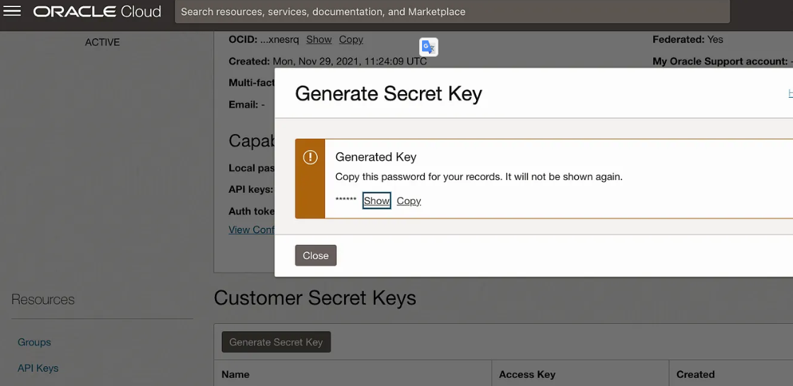

# Velero-backup

## Dependencies

- [CRDs CSI Snapshotter](https://github.com/kubernetes-csi/external-snapshotter/tree/master/client/config/crd)

To verify CRDs

```bash
kubectl get crds |grep snapshot.storage
```

To Install 

```bash
kubectl apply -k crd/
```

**IMPORTANT**
This binary helps to manage backups. Always check the version used, as the server and client must be on the same version.

Ex.

```bash

velero version
Client:
	Version: v1.11.0
	Git commit: 0da2baa908c88ec3c45da15001f6a4b0bda64ae2
Server:
	Version: v1.13.1
# WARNING: the client version does not match the server version. Please update client
```

## Install binário client

https://github.com/vmware-tanzu/velero/releases

```bash
wget https://github.com/vmware-tanzu/velero/releases/download/v1.9.5/velero-v1.9.5-linux-amd64.tar.gz
```

```bash
tar -zxvf velero-v1.9.5-linux-amd64.tar.gz -C /usr/local/bin --strip-components=1 velero-v1.9.5-linux-amd64/velero
```

```bash
chmod +x /usr/local/bin/velero
```

# EKS AWS environment

## Service roll in aws

Create a trust policy with cluster change fields <>

```json
{
    "Version": "2012-10-17",
    "Statement": [
        {
            "Effect": "Allow",
            "Principal": {
                "Federated": "<arn:aws:iam::<111122223333>:oidc-provider/oidc.eks.region-code.amazonaws.com/id/<EXAMPLED539D4633E53DE1B71EXAMPLE>"
            },
            "Action": "sts:AssumeRoleWithWebIdentity",
            "Condition": {
                "StringEquals": {
                    "oidc.eks.<region-code>.amazonaws.com/id/<EXAMPLED539D4633E53DE1B71EXAMPLE>:aud": "sts.amazonaws.com",
                    "oidc.eks.<region-code>.amazonaws.com/id/<EXAMPLED539D4633E53DE1B71EXAMPLE>:sub": "system:serviceaccount:velero:velero"
                }
            }
        }
    ]
}
``` 

Attach the policy below to the role to give velero the necessary permissions, change *BUCKET_NAME* to the name of your s3 bucket:

```json
{
    "Version": "2012-10-17",
    "Statement": [
        {
            "Effect": "Allow",
            "Action": [
                "ec2:DescribeVolumes",
                "ec2:DescribeSnapshots",
                "ec2:CreateTags",
                "ec2:CreateVolume",
                "ec2:CreateSnapshot",
                "ec2:DeleteSnapshot"
            ],
            "Resource": "*"
        },
        {
            "Effect": "Allow",
            "Action": [
                "s3:GetObject",
                "s3:DeleteObject",
                "s3:PutObject",
                "s3:AbortMultipartUpload",
                "s3:ListMultipartUploadParts"
            ],
            "Resource": [
                "arn:aws:s3:::<BUCKET_NAME>/*"
            ]
        },
        {
            "Effect": "Allow",
            "Action": [
                "s3:ListBucket"
            ],
            "Resource": [
                "arn:aws:s3:::<BUCKET_NAME>"
            ]
        }
    ]
}
```

## Install helm 

https://github.com/vmware-tanzu/helm-charts/tree/main/charts/velero

Change the necessary values in *values_aws.yaml*

- Name bucket

```yaml
...
configuration:
  backupStorageLocation:
  - name:
    # provider is the name for the backup storage location provider.
    provider: aws
    # bucket is the name of the bucket to store backups in. Required.
    bucket: NAME_BUCKET
...
```
- ARN role previously created

```yaml
...
serviceAccount:
  server:
    create: true
    name: velero
    annotations:        
       eks.amazonaws.com/role-arn: arn-abcabacabc
...
```
If you use another region, change the default to *us-east-1*.

#
```bash
helm repo add vmware-tanzu https://vmware-tanzu.github.io/helm-charts
```
```bash
helm upgrade --install velero vmware-tanzu/velero -n velero --create-namespace -f values_aws.yaml
```
```bash
kubectl get deployment/velero -n velero
```
## Test implementation

```bash
kubectl create -f nginx.yaml
```
```bash
kubectl get deploy -n nginx-example
```

## Creating a backup and performing a restore 

```bash
velero backup create nginx-backup --include-namespaces nginx-example
```
```bash
velero get backups
```
```bash
kubectl delete namespaces nginx-example
```
```bash
velero restore create --from-backup nginx-backup
```
```bash
velero restore describe nginx-backup-20221110113704
```
```bash
kubectl get deploy -n nginx-example
```
## Backup Scheduling

```bash
velero schedule create myschedule --schedule="0 */6 * * *"
```

Create a backup every six hours

or

Use the example-schedule.yaml manifest

## To delete backups

```bash
velero delete backup nginx-backup -n velero
```

## For other providers see

https://velero.io/docs/v1.12/supported-providers/

#
# Oracle cloud

the OCI Console, you will need to go to Identity->Users->User Details and select Customer Secret Keys in Resources. Click Generate Secret Key. 

  


- Create file velero-credentials

```bash
[default]
aws_access_key_id = {accessKey}
aws_secret_access_key = {secretKey}
```

- Create a secret for credentials

```bash
kubectl create secret generic cloud-credentials --namespace velero --from-file=cloud=velero-credentials
```

- Change the values as required

```yaml
 backupStorageLocation:
    bucket: velero-test-oci
    config: 
      region: us-ashburn-1
      s3ForcePathStyle: true
      s3Url: https://<<objectstoragenamespace>>.compat.objectstorage.us-ashburn-1.oraclecloud.com
```
```yaml
 volumeSnapshotLocation:
    # name is the name of the volume snapshot location where snapshots are being taken. Required.
    name: default
    config:
      region: us-ashburn-1
```

```bash
helm repo add vmware-tanzu https://vmware-tanzu.github.io/helm-charts
```

```bash
helm upgrade --install velero vmware-tanzu/velero -n velero --create-namespace -f values_oci.yaml
```      

## Install use velero

```bash
velero install \
--provider aws \
--bucket bucket-velero \
--secret-file ./velero-credentials \
--plugins velero/velero-plugin-for-aws:v1.9.0 \
--use-volume-snapshots=false \
--backup-location-config region=us-ashburn-1,\
s3ForcePathStyle="true",\
s3Url=https://<<objectstoragenamespace>>.compat.objectstorage.us-ashburn-1.oraclecloud.com
```

```bash
kubectl get deployment/velero -n velero
```

the Velero log showing that installation is OK and the BackupStorageLocation is valid and available

```bash
kubectl logs deployment/velero -n velero
```

https://velero.io/docs/v1.13/contributions/oracle-config/

## Test implementation

```bash
kubectl create -f nginx.yaml
```
```bash
kubectl get deploy -n nginx-example
```
## Creating a backup and performing a restore 

```bash
velero backup create nginx-backup --include-namespaces nginx-example
```
```bash
velero get backups
```
```bash
kubectl delete namespaces nginx-example
```
```bash
velero restore create --from-backup nginx-backup
```
```bash
velero restore describe nginx-backup-20221110113704
```
```bash
kubectl get deploy -n nginx-example
```
## Backup Scheduling

```bash
velero schedule create myschedule --schedule="0 */6 * * *"
```

Create a backup every six hours

or

Use the example-schedule.yaml manifest

## To delete backups

```bash
velero delete backup nginx-backup -n velero
```